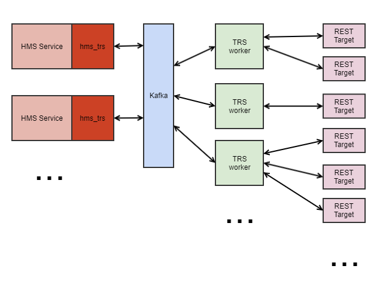
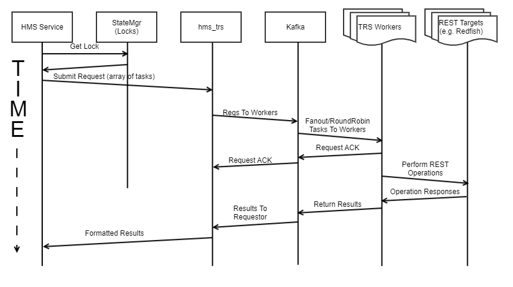
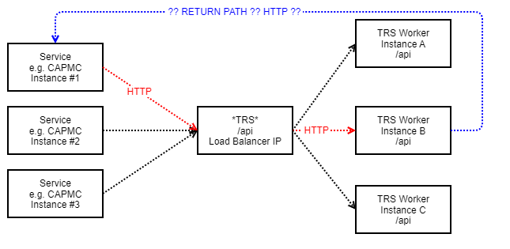
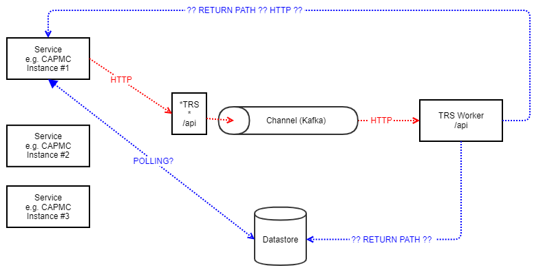
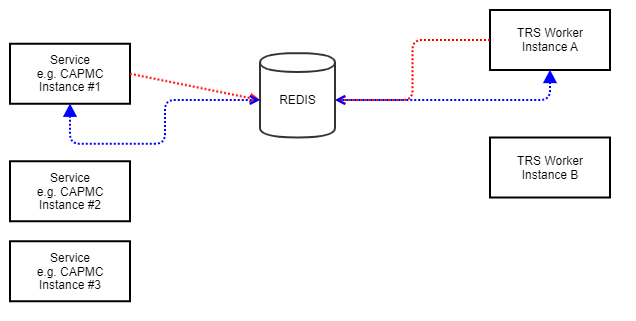

# HMS Task Runner Service (TRS)

## 1.1. Problem

All HMS services are required to scale out to large system sizes.  Services that perform tasks on hardware or other services will eventually have to do so on a very large number of targets. For example, CAPMC will need to be able to send power-on commands to a large number of components when booting a large system.

Each HMS service that fits this description (e.g. SMD, HMNFD, CAPMC, FUS, etc.) will thus need to be fashioned to scale.  Each service can worry about and implement its own scaling methods or they could all use a common scaling services – Task Runner. 

The problem is explained in more detail [Designing for Scalability - Using Work Queues in RESTful Microservices](file:////confluence/display/CASMHMS/Designing+for+Scalability+-+Using+Work+Queues+in+RESTful+Microservices)

## 1.2. Solution 1: Each Service Doing Its Own Scaling

One way to accomplish scaling overall of HMS services is that each service would implement its own scaling methodology.  This can work, and is the path we are currently on.

## 1.3. Solution 2: Do Scaling In A Single Place – The Task Runner Service

A more efficient and uniform way to do scaling is to use a common service for scale-out – the Task Runner service.

This service is an engine which performs REST-based tasks. It runs as a scalable service itself, and takes as input requests to perform some number of tasks. TRS then performs that tasks and returns the results. 

Applications utilize TRS as a GO library. In the future there is also likely to be a Python version of this library/object. Kafka is used as the "glue" which binds everything together.

## 1.4. Task Runner Block Diagram

 

​                        

 

**In a nutshell:**

Each HMS service will utilize a library/GO package – ***hms_trs\*** – to perform the fanout operations. A data structure containing a slice of targets and operation parameters is passed from the service into a *hms_trs* function. This gets parsed and placed onto the Kafka bus (the shared services one, not the telemetry one). The TaskRunner worker pods subscribe to topics – one topic inbound to the worker pool and one outbound/return per HMS service – and receive the operation descriptions.  Each TaskRunner worker then performs the REST operation(s) it is given to do.  The results are formatted into JSON and returned back via Kafka to *hms_trs*, where the results are then acted on by the HMS service.

Note that by using TaskRunner, the HMS services which require sending messages to large numbers of targets or which require performing Redfish tasks/queries on large numbers of targets can do so with easy-to-use and common package functions. The minimum number of copies to maintain usability and HA for a service are deployed, and that number can be largely static. The scale-up and scale-down is confined to the TaskRunner worker pods.

Services that require scaling due to potentially large volume of inbound messages (e.g. HBTD) will not benefit at all from TaskRunner; these services have to be scaled themselves.

### 1.4.1. Kafka Usage Model

Kafka topics will be set up to allow applications to submit tasks to the worker pods.  

There will be one topic used to convey traffic from services to the TRS worker pods. The worker pods will subscribe to this topic using the same consumer group, resulting in Kafka becoming a round-robin load balancer. Each request get sent to the next available worker pod.

For return traffic, each pod will subscribe to topics set up for each service which acts as a path for return, status, and ACK data.  The request descriptor will contain information as to who sent the request and which return topic to use to send the response.

In addition there will be a topic for each service that uses the TaskRunner service, used for sending responses to the sending service. The service's pod copies will each subscribe to this topic (e.g. cray-hms-taskrunner-capmcd-ret), using a random consumer group so that all copies of a service get the responses.  Responses will be filtered according to sender ID so that only the sender acts on the response.

#### 1.4.1.1. Data Security

Since it is possible to "snoop" on Kafka topics using tools supplied by Kafka installations (and included in kafka k8s pods) data will be encrypted using Kafka's built-in encryption model. While is would still be possible to snoop on topics, it would be necessary to get the SSL information used by the Kafka setup to do so. That info will be available to developers but is not available in general. (TBD).

### 1.4.2. Local Model

TRS can be used in "local mode" as well.  In local mode, neither Kafka nor the remote worker pods are used. Instead threads are spun off for each target and operation and the REST operations are done in each thread.

This model is functionally much simpler, at the expense of scaling. It will scale to some degree but not to large scales.  It is expected that local mode can likely scale up to perhaps 5000 targets.

The intent of local mode is for initial implementations. Services can utilize local mode early on until worker mode has been vetted and is ready for prime time.

Since the TRS API library is written as an interface with 2 modes, local and worker, applications can trivially switch between local and remote mode, and it is expected that service will be written to do exactly that.

Local mode can also serve as a debugging tool. If some parallel REST operation is failing, local mode can be used as a method of isolating the problem.

## 1.5. Scenarios

The following usage scenarios are supported:

- Fire-n-forget. In this case, a set of tasks can     be sent to the worker pods and no response is expected.
- Blocking operation. In most cases this will be a     short-lived GET operation, or perhaps a POST which results in returned     data. 
- Non-blocking long-running operation.  In     this case, a set of tasks, each expecting to take long enough to not want     to wait. Once the tasks are launched, the application launches     subsequent tasks to query the status of the long-running operation until     complete or timed out.
- Blocking long-running operation. TRS worker pod     will execute the task and keep the connection alive and respond when     done. NOTE: this case should be avoided as much as possible!

## 1.6. Errors And Timeouts

Each task set contains timeout information. The workers will use this information to enact limits on task prep/setup time, execution time, and overall time.  Exceeded timeouts cause error responses with requisite information. 

An error value is returned to the caller indicating the type of failure. In addition, the request slice entries also contain the response data complete with error codes and error data, allowing the caller to know exactly which tasks failed and why.

### 1.6.1. Timeouts

A time limit can be set on a task. If the operation takes longer than the specified time, the operation is cancelled and an error is returned. NOTE: leaving the timeout set to 0 (the default) will result in immediate cancellation of the task!  

## 1.7. Use Cases

We have identified several use cases ordered by service name. This is not an exhaustive list.

- **CAPMC** 

- - performing      power operations (POST) - need to send power commands as Redfish operations to      multiple targets (turn nodes on/off, reset, etc.)
  - fetching power data      (GET) - need to query multiple components via Redfish to get certain      information, e.g., power capping info.

- **FUS** 

- - queries for firmware      version info (GET) - need to query multiple components via Redfish for FW      version info.
  - performing firmware      updates (POST) - need to perform FW updates on multiple targets via      Redfish operations.

- **HSM** 

- - performing discovery      (GET) - need to fetch various information from Redfish as part of      discovery.

- **HMNFD** 

- - state change      notification fanout (POST) - need to send JSON-formatted messages      regarding component state changes to multiple nodes.

- **Future Services** 

- - changing      credentials on BMCs or Controllers (POST, DELETE?) - HMS will at some point      need to be able to change BMC or Mountain controller credentials en      masse.
  - setting/changing      network protocol information on BMCs or Controllers (GET, PUT, POST?)      - Syslog      collector target, NTP server, SSH key info will need to be set on BMC or      Mountain controllers en masse.

## 1.8. Design Principles

- TaskRunner will use Kafka as its transport between     clients and worker pods (in worker mode), NOT HTTP/REST, to leverage     Kafka's message delivery prowess as well as it's natural load balancing.
- Workers will not contact Vault for creds; creds will be     passed to the workers with the operational payload. (to avoid privilege     escalation)
- The payloads will have to be encrypted to hide     sensitive information. The assumption is that Kafka will be set up     to encrypt its traffic.
- Tasks executed by the workers will be fully HTTP REST,     using standard GO HTTP request objects. All of this info will be     passed to the workers in the payload.

### 1.8.1. **Things We Can Leverage**

- Kafka (already using it heavily) for task/status     delivery, load balancing, recovery.
- Kubernetes infrastructure for worker pod deployment and     scaling

### 1.8.2. Things that need to be developed (not 3rd party)

- Kafka library (already exists)
- Kafka topics specification and deployment
- *hms_trs* API
- RR worker service
- RR worker service installer/deployment (Helm chart,     installer, scaling factors, etc.)

## 1.9. Task Fanout Sequence Diagram

​                        

 

### 1.9.1. Sequence

1. Optional: Application may require component     locks from HSM (not part of the *hms_trs* API). If this     fails, application must not continue.
2. Application creates and submits request to *hms_trs*.      This request is an array of descriptors each containing targets, operation     payloads, operation URLs, etc.
3. *hms_trs* sends each request to worker nodes via Kafka.
4. Workers send back ACKs to let *hms_trs* know     whenever a request is taken off of Kafka and is being worked on.
5. Workers perform task(s), in parallel.
6. Application may send status queries to workers.
7. Once application is satisfied that tasks have been     completed or has dealt with error conditions, returns back to caller as     appropriate.

## 1.10. Scale-Up/Down Of Worker Pods

TRS will leverage the built-in mechanisms in kubernetes for increasing or decreasing the replica count of the worker pods in response to the pods' workloads. The specifications given to the auto-scaling mechanism are TBD but most likely will be based on CPU and/or memory utilization.  We may need to look at implementing a custom metric since CPU and memory utilization may not tell the entire tale.  For example a TRS worker pod can be executing 10 jobs simultaneously and be waiting for the responses, but we may not want to load it down further. We may use a kubernetes operator to govern the scaling of the worker pods.

## 1.11. TRS Library API

hms_trs is a Go package containing functions to initialize the TRS mechanism, create task/response descriptors, execute the tasks, wait for and coalesce the responses. Services use this library in place of duplicate scaling efforts.

This library will have 2 modes – worker mode and local mode.  In worker mode, the tasks are submitted to the TRS worker pods as described above.  In local mode, the tasks are simply executed locally using a limited thread pool.  Local mode is used for testing and debugging, but is not meant for general use; it is very unlikely to scale well.

Initially this will be Go-only but in the future there may be a Python implementation.

The typical use model will be:

1. Declare an instance of either a local or remote TRS     object (for the sake of argument, call it "obj")

2. Call obj.Init() 

3. Create a source task descriptor to duplicate, populate     fields to duplicate, then call obj.CreateTaskArray(). Notable fields     to set are:

4. 1. task.ServiceName –      name of your service, for debugging purposes
   2. task.Timeout – Overall      operation timeout
   3. task.RetryPolicy –      Retry on failure policy, includes number of retries and max time (in      seconds) per back-off attempt

5. Launch the array of tasks via obj.Launch(). This     function returns a chan which can be listened on for responses. It     can also be safely ignored.

6. Either monitor the chan returned by obj.Launch() or use     obj.Check() to check on the status of the task array.

7. When the tasks are all finished, call obj.Close()

Note that no Kafka topics are specified in any step. The kafka topics are created "under the covers" in a predictable way using the service's name and sender ID as well as the direction (send, receive).  The caller need not know these topic names other than when setting up the service's deployment, in order to create the Kafka topics.

The Kafka topic naming convention is:

```
trs-appname-class-dir
 
 
    appname: application name as passed into obj.Init()
    class:   application class, to date will always be "rest"
    dir:     topic "direction", which will be "send" or "rcv"
 
 
Examples:
 
 
trs-capmc-rest-send
trs-capmc-rest-rcv
```

 

 

```
type RetryPolicy struct {
        Retries        int
        BackoffTimeout time.Duration
}
 
type HttpTask struct {
        id            uuid.UUID // message id, likely monotonically increasing
        ServiceName   string    //name of the service
        Request       *http.Request
        TimeStamp     string // Time the request was created/sent RFC3339Nano
        Err           *error
        Timeout       time.Duration
        RetryPolicy   RetryPolicy
        context       context.Context
        contextCancel context.CancelFunc
}
 
// The TRS API interface
 
 
type TrsAPI interface {
    Init(serviceName string, logger *logrus.Logger) error
    CreateTaskList(source *HttpTask, numTasks int) []HttpTask
    Launch(taskList *[]HttpTask) (chan *HttpTask, error)
    Check(taskList *[]HttpTask) (running bool, err error)
    Cancel(taskList *[]HttpTask)
    Close(taskList *[]HttpTask)
    Alive() (ok bool, err error)
    Cleanup()
}
 
 
 
 
// The following data structures are examples of what will be used by the TrsAPI interface.
 
 
type TRSHTTPLocal struct {
    //non-public members
}
 
 
type TRSHTTPRemote struct {
    //non-public members
}
 
///////////////////// Functions ///////////////////////////
 
// NOTE! In the examples below, the TRSHTTPLocal struct will be used
 
// Initialize the TRS library.  Idempotent; calling with different values modifies subsequent operation
//
// serviceName:  Name of the service, e.g., CAPMC
// logger:       Logrus or compatible logger
// Return:       nil on success, error on failure.
 
func (tloc *TRSHTTPLocal)Init(serviceName string, logger *logrus.Logger) error
 
 
// Create an array of task descriptors.  Each element in the generated array will be populated 
// with the data in the source descriptor.  Notable fields in the source descriptor:
//   ServiceName -- Name of your service, e.g. hmnfd
//   Timeout     -- Max timeout of overall operation
//   RetryPolicy -- Max number of retries and max backoff time (in seconds as time.Duration) per attempt
//
// source:     Ptr to ask descriptor to copy from.
// numTasks:   Size of array of tasks descriptors to create
// Return:     Array of task descriptors populated with source data.
  
func (tloc *TRSHTTPLocal)CreateTaskList(source *trsapi.HttpTask, numTasks int) []trsapi.HttpTask
 
 
// Launch an array of tasks.  Any error(s) encountered will be reflected by the returned error.
// Details can be found in the individual descriptors.  Note that once the operation is launched,
// it can be canceled via the Cancel() function.
//
// taskList:     Ptr to array of tasks to launch
// Return:       Chan of *HttpTxTask, sized by task list, which caller can use to get notified
//                 of each task completion, or safely ignore if desired.  CALLER MUST CLOSE
//                 or allow to go out of scope.
//               nil on success, otherwise error message.  Individual tasks can be inspected for errors.
 
func (tloc *TRSHTTPLocal)Launch(taskList *[]trsapi.HttpTask) (chan *trsapi.HttpTask,error)
 
 
// Check an array of tasks for completeness/done-ness.  If any task encounters an error, or if
// the overall task set exceeds its timeout, an error is returned.
//
// taskList:  Ptr to array of tasks to inspect
// Return:    running:  true == still running
//            err:      nil == all is OK, else something is wrong, even if still running
 
func (tloc *TRSHTTPLocal)Check(taskList *[]trsapi.HttpTask) (running bool, err error)
 
 
// Check various items to see if we are healthy as a system.  Ping workers, verify responses, etc.
// Can be used by /health API or just a general health check in the service.
//
// Return: ok:  true == all is well.
//         err: if ok == false, contains what is wrong.
 
func (tloc *TRSHTTPLocal)Alive() (ok bool, err error)
 
 
// Cancels the current operation.  Note that this doesn't cancel in-flight sub-tasks.
//
// taskList:  Ptr to array of tasks associated with task set to cancel.
 
func (tloc *TRSHTTPLocal)Cancel(taskList *[]trsapi.HttpTask)
 
 
 
// Close out a task list transaction.  This frees up a small amount of resources
// so it should not be skipped.
//
// taskList:  Ptr to array of tasks associated with task set to close.
 
 
func (tloc *TRSHTTPLocal) Close(taskList *[]trsapi.HttpTask)
 
 
 
// Cleans up current state and prepares for exit.  Used for graceful shutdowns.
// Will perform at least the following:
//   o Stop popping inbound jobs off of Kafka
//   o Kill running tasks (kill http contexts, etc.)
//   o Wait for jobs to drain and worker threads to free up
//   o Cleanly shut down Kafka and any other connections
//
// Return:  nil on success, error string if something went wrong
 
func (tloc *TRSHTTPLocal)Cleanup() error
```

 

## 1.12. AuthN/AuthZ

Initially AuthN and AuthZ will be set up such that the TRS worker pods will authorize and authenticat the same way as the services that use it. In the future this may need to be expanded. 

It will be important to not introduce a method of privilege escalation by having a lower privilege service use a higher privilege TRS pod.

## 1.13. HTTPS/TLS And Credentials

Tasks executed by the worker pods may need to use https. This is very true for Redfish operations. Other operations may only use simple http protocol, contacting entities within the service mesh (where the TRS worker pods run).

Using https can be done in various ways:

- Avoiding TLS verification (a.k.a. 'curl -k').      This avoids some checks and makes https easier. This is hard coded     for now, and may be selectable in the future.
- Using Basic Authentication. (a.k.a. 'curl ... -u     uname:pword ...).  The task structure's Request field can call     its SetBasicAuth() method to set these.

·    Using token-based authentication (a.k.a 'curl ... H "X-Auth-Token: "aabbccddeeff223u" ...) These are set as headers using the task structure's Request field's Header field.

Each of these is possible in TRS. As shown in each of the above scenarios the task structure's http.Request field will allow each of these methods.

## 1.14. Future Enhancements

### 1.14.1. Python Interface

If there is enough call for it, there may be a Python implementation of the TRS library. This would allow a Python-based service or job to use TRS workers to do its work.

### 1.14.2. Journaling

There are many HMS services that will require some form of journaling in order to be able to pick up where a copy of a service unexpectedly died, e.g. to finish up or clean up an in-flight operation left behind.

TRS is no exception. The TRS workers will need to journal what they are doing so that if a worker pod dies in the middle of an operation, when a new copy starts up it can look for orphaned operations and finish them up or clean up after them. This will allow for as close as possible to lossless operation across pod restarts.

### 1.14.3. Payload Sizes and Multi-Part Messages

There will be a maximum size for task payloads and return payloads.  This is TBD but is expected to be somewhere in the low numbers of megabytes, say, 5 MB. We don't want to allow messages to get too large since on large systems there can be a large number of large messages which could clog things up. Request and response payload max sizes will be the same.

As with journaling, many HMS services will eventually need to handle multi-part messaging. This comes into play when an operation requires a payload so large that it will swamp a service. For example, if a service requests the full HW inventory data for every node in the system in one single call, this would result in a JSON payload that would be potentially close to a gigabyte or more. This would result in the service needing enough memory to store the payload as it's building it and then handing it off to an HTTP function which may make a copy. The memory resource constraints could easily be blown and it could result in pods dying due to running out of memory.

The answer to this is a common mechanism called Multi Part Messaging. TRS, as other services, will eventually need to be able to handle this, potentially on the worker pod side and definitely on the library side.

### 1.14.4. Emergencies and Task Abort

Initially there will be no mechanism for task abort.  After much deliberation it was determined that there generally isn't much good that comes from aborting a task. A long running task, when aborted, typically can't really actually abort what's going on.  An example of this is a firmware update. Once it is started, you can't stop it.  Aborting the task won't really help much. And since the TRS pods execute tasks in parallel, it will still be possible to do other things while the FW update runs its course. So little is really lost by not being able to abort tasks.

#### 1.14.4.1. EPO

One potential exception to this is the Emergency Power Off (EPO). When an EPO is to be done, we need to abandon most other tasks related to power, booting, etc. 

In the simple/naive case, TRS workers could interfere with this process. CAPMC could send out power-off commands while something like BOS is sending power-on commands. TRS workers might execute them in an undesirable order.

The fix for this is simple.  BOS uses CAPMC (and in the future the Power Control Service). All that needs to happen is for CAPMC/BOS to do the following sequence:

1. Break any HSM locks for target EPO components
2. Acquire those same locks
3. Proceed with the power-off operations.

This may not be 100% perfect, but it is likely to be much closer to perfect than the current design. TRS certainly won't make things worse.

One thing to consider is that EPO in Shasta is done in Software, and therefore can't be guaranteed to execute perfectly or within a guaranteed amount of time without resorting to lots of horrible tricks with real time scheduling. With all of the overhead and complexity of Kubernetes and Docker, the latencies of Redfish operations, etc. it just isn't possible. 

Contrast this to Cascade EPO which was done by a dedicated micro-controller, and came with guarantees for maximum delay from incident to power-off.

 

## 1.15. Application Usage Of TRS

Following is a very rough pseudo-go coded example of the scenarios listed above.

**Parallel GET operations returning data**

```
...
var source trsapi.HttpTask
var tloc trsapi.TRSHTTPLocal
logger *logrus.Logger
 
 
logger = logrus.New()
logrus.SetFormatter(&logrus.TextFormatter{FullTimestamp: true,})
logger.SetFormatter(&logrus.TextFormatter{FullTimestamp: true,})
tloc.Init(myServiceName, logger)
 
 
source.Request = http.NewRequest("GET","http://www.example.com",nil)
source.Timeout = 10 * time.Second  // each task should take no more than 10 seconds to complete
source.RetryPolicy.Retries = 5     //max 5 retries on failure
source.RetryPolicy.BackoffTimeout = 6 * time.Second //max back-off for retries
 
 
taskArray := tloc.CreateTaskList(&source,100)  //create set of 100 HTTP tasks
 
// Set information specific to each task in the set
 
for ii,_:= range(taskArray) {
    taskArray[ii].Request.URL,_ = neturl.Parse(targetURL)  //target URL
}
 
rchan,err := tloc.Launch(&taskArray)   //execute tasks
if (err != nil) {
    //lib func failed for some reason
}
 
 
// Monitor the chan for responses
 
 
nDone := 0
 
 
for {
    tdone := <-rchan
    log.Printf("Task complete, URL: %s, return data: '%s'\n",tdone.URL,string(tdone.Response.Payload))
    nDone ++
    if (nDone == len(taskArray)) {
               break
        }
}
 
log.Printf("DONE!\n")
```

 

**PUT, poll for status rather than use the Launch chan**

 

## 1.16. **Error Handling**

There are several types of errors that can happen during a task list execution.

### 1.16.1. Bad URLs 

If a bad URL is specified, a 404 will be returned, generally very quickly.  Straightforward.

### 1.16.2. Server Error

Many types of server errors can occur. Some of these happen quickly, others take more time. Straightforward to debug, generally.

### 1.16.3. Server Crashes/Hangs

This type of error can result in task(s) in the task list to time out. An appropriate error message will be generated when that happens. It is important to set a reasonable timeout for all operations to prevent application hangs. Hangs/long timeouts can be terminated with the obj.Cancel() method if desired, but that requires the application to have control while the task set is executing.

## 1.17. **Methodology Comparison**

```
...
var source trsapi.HttpTask
var tloc trsapi.TRSHTTPLocal
logger *logrus.Logger
 
logger = logrus.New()
logrus.SetFormatter(&logrus.TextFormatter{FullTimestamp: true,})
logger.SetFormatter(&logrus.TextFormatter{FullTimestamp: true,})
 
 
//Use default of 3 retries with max of 5 seconds per back-off between retries, and 20 second timeout
source.Timeout = 20 * time.Second  // each task should take no more than 10 seconds to complete
taskArray := tloc.CreateTaskList(&source,100)  //create set of 100 HTTP tasks
 
 
// Set information specific to each task in the set
for ii,_:= range(taskArray) {
    taskArray[ii].Request,_ = http.NewRequest("POST",targetURL,targCommonPayload)
    taskArray[ii].Request.Header.Set("Context-Type","application/json")
}
 
rchan,err := tloc.Launch(&taskArray)   //execute tasks
if (err != nil) {
    //lib func failed for some reason
}
 
 
// Responses will come back asynchronously.  Call a function to see progress
 
isRunning := true
for isRunning {
    isRunning, err:= tloc.Check(&taskArray)
    time.Sleep(100 * time.Microsecond)
}
 
// Check for errors
 
numOK := 100
for ii := 0; ii < len(taskArray); ii++ {
    if (taskArray[ii].Request.Response == nil) {
        log.Printf("Error, no response from task, URL: %s %s.",taskArray[ii].Host,taskArray[ii].URL.Path)
    if (taskArray[ii].Request.Response.StatusCode >= 400) {
        log.Printf("Error from task, URL: %s %s,  status: %d\n",
            taskArray[ii].Host, taskArray[ii].URL.Path, taskArray[ii].Request.Response.StatusCode)
        numOK --
    }
}
 
if (numOK < 100) {
    log.Printf("Tasks completed with errors:\n")
    // List error tasks
    return errmsg
}
 
log.Printf("All tasks completed successfully.\n")
 
// Grab task output
 
for ii := 0; ii < len(taskArray); ii++ {
    if (taskArray[ii].Request.Response == nil) {
        continue
    }
    body,berr := ioutil.ReadAll(taskArray[ii].Request.Response.Body)
    if (berr != nil) {
         log.Println("Request read error:",berr)
         continue
    }
        payload,jerr := json.Unmarshal(body)
    if (jerr != nil) {
         log.Println("Request unmarshal error:",jerr)
         continue
    }
        log.Printf("Return data from %s %s: '%s'\n",taskArray[ii].Request.Host,taskArray[ii].Request.URL.Path,payload)
}
log.Printf("DONE!\n")
```

### 1.17.1. **Each Service Does Its Own Scaling**

#### 1.17.1.1. **PROS:**

- It's the path we're on – less disruption to the     development of services
- Each service tailors its scaling needs.

#### 1.17.1.2. **CONS:**

- Duplication of scaling effort. Some code re-use     may be possible but most likely each service will custom-fit its own     scaling methods.
- Increased likelihood of 'flawed' scaling     implementation. Scalability can be hard to get right, by     standardizing the scaling mechanism we can create one, robust, testable,     verifiable, entity rather than the risk that scalability will be done     'partially wrong' in a service. This isn't a denigration of     developer efforts, but this is complex, so a shared service reduces risk.
- Resource consumption.  Each service's     scaling implementation will involve instantiating multiple copies of     itself, each occupying memory, CPU, etc.
- Debug-ability is more difficult. Since each     service's scaling implementation would be different to some degree,     debugging things is more difficult.
- Individual service scaling requires very thoughtful     implementation so that statelessness is preserved. If a CAPMC     request goes to CAPMC_a vs CAPMC_b (because of load balancing) we'd want     CAPMC to have a shared scaling component so there isn't resource     contention, or stateful conflicts.

### 1.17.2. **TaskRunner**

#### 1.17.2.1. **PROS:**

- **Easier     Scaling**     

- - Services which can      utilize TaskRunner can have a minimal number of copies just to maintain      HA. All of the scaling is done in TaskRunner.  In      addition, scaling TaskRunner fixes scaling issues for all services that      utilize it – a one-stop shop for scaling.
  - Scaling can be done      using kubernetes built-in mechanisms with little effort.

- **Resource Efficiency** 

- - If every service has to      scale on its own, there will be lots of copies of each one running.       This consumes CPU and memory resources. There will generally be      more copies of each service than are strictly needed, using resources.
  - If all of the scaling      is done in TaskRunner, then the numerous copies are all in one place,      minimizing the consumption of resources.

- **Maintainability** 

- - Since all scaling is      done on one service, if there is a problem with scaling it can be fixed      in one place, benefiting all services that use it. This will be      much easier than having to fix scaling in multiple services, each using      its own scaling methods.

- **Debug-ability** 

- - Since all scaling is      done in one service, debugging scale issues is also done in one      place. This simplifies the effort to find and fix scaling problems.

- **Gradual Deployment** 

- - Services that need to      be modified to use the TaskRunner service can be done gradually.       There is no "flag day". TaskRunner can be deployed and      then services can adopt it whenever it is convenient. TaskRunner      does not prevent any other scaling methodology.

- **Testability/Debuggability** 

- - Services can use      "local mode" to do testing. No worker pods or Kafka are      used in this case, but the operations are done locally.

#### 1.17.2.2. **CONS:**

There are no direct cons for implementing TRS

### 1.17.3. **TRADEOFFS:**

- **Time & Resource     Alignment**

- - Something needs to be      done to increase the scalability of the services (CAPMC, FUS, etc)       This can happen solely in the service, or can happen in TRS and be      utilized by the consuming services. Services will need to be      partially re-written either way; it is our position that the time to      implement will be less (overall) by using TRS then if each service      attempts to solve scalability on its own.
  - However, before any      consuming service can use TRS it must be implemented, this effort would      be in the critical path for services to achieve scalability. 

## 1.18. Design Alternatives

A key consideration for all the design alternatives is what is the mechanism of data flow, and how is return data sent by a worker and received by a consuming service (e.g. CAPMC). 

### 1.18.1. Kubernetes load balancer + restful API



An alternative we considered was using built in k8s auto-scaling with a traditional HTTP (Restful) API. In this example an HTTP request (containing a set of HTTP Requests as a payload) is sent from a consumer service instance #1 (e.g. CAPMC) to the load balanced IP of TRS. The load balancer sends the request to TRS worker instance B. Because the request is a long running job the HTTP request is closed; perhaps a token or ID of some sort is returned to the requesting service. 

The identified flaw in this approach is HOW does data get back to the original requester? The original HTTP request will be closed, so the consumer service must have some sort of endpoint setup for it to receive the return payload(s) from the TRS worker, this is problematic because the consumer service is behind a load balancer, so there is NO guarantee that the original instance will get the return payload. If this is NOT done, then the requesting service must POLL TRS, which because of load balancing means all TRS workers MUST be stateless and have a mechanism for storing the payloads. If we utilize polling then we most likely lose the advantage of having a distributed worker service, because we will have an increased overhead in the consuming service. 

### 1.18.2. Knative / Lambda

​                        

An alternative we considered was using a lambda like worker solution. In this example an HTTP request (containing a set of HTTP Requests as a payload) is sent from a consumer service instance #1 (e.g. CAPMC) to TRS. TRS (if implemented with Knative with Kafka) would put work on a channel that gets pushed to a sink, and executed. 

The identified flaw in this approach is HOW does data get back to the original requester? The original HTTP request will be closed by TRS.

From our research, lambda like solutions can be created to write to a data store of their choosing, but this puts to burden back on the consumer service to have a polling mechanism against a data store, or to have some sort of endpoint to receive return payloads. However as mentioned previously we most likely lose the advantage of having a distributed worker service, because we will have an increased overhead in the consuming service as well as the consumer service is behind a load balancer, so there is no easy way to get the request back to the specific consuming service instance. 

### 1.18.3. Redis (or other Database/ Datastore)

​                        

An alternative we considered was using a database like Redis that has distributed key-space notifications. In this example, a consuming service could write to the database, the workers would be notified of work in the queue. A worker would pull the work off of the queue, perform the work and write it back to the database. The consuming service would be notified of a return payload in the database. The consuming service could then retrieve data from the database.

The identified flaw in this approach is that because of how key space notifications work, all instances of TRS would be notified, there would be a race to select the entry, with only one winner. Because of the race, it is possible that other requests occurring in the selection window could be ignored and not selected. The same problem exists on the return side, where the sibling instances of the consuming service would race for the same key space notification.

### 1.18.4. TBD

 

- Slice of slices in API?
- Logging topic on Kafka for one-stop-shop for app, lib,     worker errors?

 