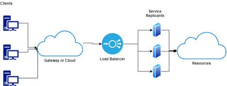
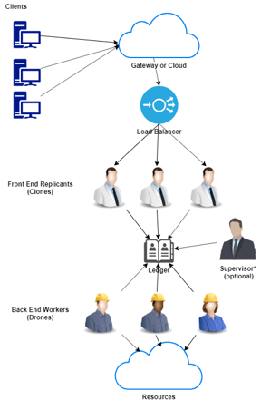

# Designing for Scalability - Using Work Queues in RESTful Microservices

Author: Andrew Nieuwsma

An often acclaimed advantage of the RESTful microservice architecture is the ability to scale. While REST can lend itself to scalability there many design considerations that impact a service’s ability to scale. In this paper we will explore some of those design considerations and explore using work queues as a pattern for achieving increased scalability.

The *typical* RESTful microservice looks like this:

Traffic flows from **clients** through a **gateway** (where we can apply AuthN/AuthZ) and proceeds to a **load balance**r that will distribute requests to *n* **replicants**. The replicants may need to access external **resources**. In this simplistic model, scalability can be achieved either by the load balancer directing traffic across many replicants *(horizontal scaling*) and/or by traffic being routed to different resources based on the URL of the resource (this is the *RE - representational part of REST*).

## Inbound Scaling

Much of the initial consideration of scaling involves using a load balancer to meter incoming requests. A service can have *n* replicants (running instances of the service) and requests will be distributed across the pool.  This mechanism scales well, but can be limited by the resource design.

Consider a simple math calculator service. A horizontally scaled service could have *n* replicants to handle increased load in the service. Each replicant is an instance of the calculator application. Because each request to a calculator does not require prior state (this is the *S - stateless part of REST),* we can create as many instances of the calculator as we need in order to satisfy the demand.  E.g. *a + b = c, is a single request.*  In a RESTful microservice *stateless* means “every HTTP request happens in complete isolation… the server never relies on information from previous requests.” [https://restfulapi.net/statelessness/]

Consider the pet store example. [https://petstore.swagger.io/]. Each separate resource: user, store, and pet could be distributed across different backend resources. For example, the user resource could be backed by a transactional database that links to some authentication provider; the store resource could be a facade for a larger organizational service. This ‘fragmentation’ allows for greater scalability and more flexible availability. Resource modeling helps make REstful microservices REpresentational.

Scalability can be partially achieved by using a load balancer. However the underlying resource must be designed in such a way as to allow for meaningful partitioning. Consider again the calculator application. Imagine if each operand (a,b) and each operator (+,-) required a separate request to the service. In such a scenario each request would have to provide the context for the sequence of operations so that the system did not confuse requests when the load balancer distributes requests to separate calculators. The statefulness of this contrived implementation would make scalability very difficult.

REpresentation(al) and Stateless design are definitional to REST. They allow a service to have inbound scaling. However, beyond in bound scaling we should consider *in situ* scaling.

## In Situ Scaling

Consider the local bank. If we were to represent a bank as a collection of resources at bare minimum we would probably include: accounts and transactions. Customers have accounts and make transactions that credit or debit into the vault. There is a queue that feeds into the line of tellers and a vault to make transactions (deposits or credits) against.

The queue that leads to the tellers is analogous to the load balancer. The bank manager can adjust the number of tellers to scale with the number of customers in line. A teller can only serve one customer at a time, but a customer may have several things to accomplish during their visit. 

For our example customer Able visits teller Adam and asks for a listing of all his accounts and their standing balances. Likewise customer Betty visits teller Brandi and asks for a listing of all her accounts and their standing balances. Able has one account so the retrieval process is rather quick allowing Adam to service the next customer, however Betty, a serial entrepreneur, has dozens of accounts, one for each of her many businesses. Brandi will be occupied for quite some time helping Betty before she can assist any additional customers.

The Bank Manager Matthew can add additional tellers to help service other customers, but he is probably limited in how he can help Brandi service Betty faster. This analogy doesn't perfectly match to RESTful design, but traditional ‘load balanced’ horizontal scaling can be bottlenecked by requests that are large comparatively. An argument can be made that Betty needs to separate her requests, but this is not always reasonable. In our contrived example let's imagine the customers find it unreasonable to queue/dequeue for each separate request. There are many examples of atomic sequences, some are defined by policy and others of functional necessity.

Breaking with our bank example consider a service that is responsible for the correct power sequencing of a supercomputer (CAPMC). A supercomputer has many individual components with parent/child relationships and the power sequence is very complex. It is also important that any power sequence be considered an atomic transaction otherwise the outcome of the power sequence cannot be deterministic. In this example it is not just a matter of policy to treat the power sequence as atomic, it is an operational necessity, without it the service cannot accomplish its task and therefore the service is not viable.

What can our Bank Manager Matthew do? Perhaps he could send some banking assistants to help Brandi with her task. Seems reasonable. But now the problem is more complex as there must be a mechanism for data and work synchronization. Brandi’s task has two components: identify the accounts, and retrieve the account balances. As the list of accounts are determined assistants can retrieve the individual balances. This task parallelization via work queue is very scalable.[http://ccl.cse.nd.edu/software/workqueue/] If Betty has thousands of accounts Matt can continue to add assistants until the task is complete.

It is important that Brandi not have a *personal* assistant, i.e. assigned *only* to her, otherwise the scalability of the system will just be constrained by the number of assigned assistants. Instead a shared assistant pool allows for backend scalability, allowing assistants to switch between tellers and tasks as the Manager Matt directs. Even in our hypothetical example, Matt has a limited number of assistants, so scalability can still reach a saturation point, but the time to fulfill the request can be reduced dramatically using the work queue approach.

A work queue can be a great mechanism to provide in situ scalability. Every work queue needs some sort of ledger and some mechanism to divide the work. The application (e.g. the RESTful microservice) would need to be able to divide the work reasonably, which does not occur automatically but is the consequence of design and thoughtful resource modeling. Furthermore the use of a ledger helps provide availability as work items can’t ‘die’ with the workers, but remain on the ledger until expired or satisfied.

A RESTful microservice that utilizes a work queue may look like this:

Traffic flows from **clients** through a **gateway** (where we can apply AuthN/AuthZ) and proceeds to a **load balance**r that will distribute requests to *n* **replicants**. The replicants may have a request that is too big for them to fulfill on their own so they leverage the power of **workers**. A replicant would divide the work into the **ledger** where **workers** can pick up a task and complete it. **Workers** and **replicants** may need to access external **resources**. An optional **supervisor** may be responsible for spinning up additional **workers**, but there are ways to allow replicants to manage that process. In this more detailed model, scalability can be achieved by:

1. Front end load balancing -> spinning up **replicants**     to handle requests.
2. Back end load balancing -> spinning up *free agent **workers**     to handle work in the **ledger**. *Free agent     denotes that workers are not bound to a specific **replicant**.
3. Task balancing -> ledger allows for work     synchronization.

## Points for Consideration

In order to leverage a work queue for increased scalability a service must have a well reasoned design. Points for consideration are:

1. Is the service stateless? E.g. each instance of a     replicant or worker maintains no internally cached state

2. Is the service representational? E.g. are there     separate resources (URLs), as opposed to RPC resources: /doDebit,     /doCredit, /doNewAccount

3. What is the task model for the service?

4. 1. Which items will be      considered for the work queue, vs something a front end worker can ‘just      handle’; e.g. GET version, or Create a new account

   2. Are any tasks      sequential?

   3. 1. E.g. task A must be       completed before attempting task B? Vs task A & B can run       together.

5. What is the mechanism of work scheduling? FIFO?     Preemptive?

6. What is the mechanism for accounting? I.e. how the     service ensures no dropped request. How the ledge is maintained.

7. What is the mechanism and policy for spawning and     reaping workers (clones & drones)?

8. What is the mechanism of communication between the     ledger and the workers (clones & drones)?

9. 1. Direct datastore      access?
   2. A service layer?

 

 

 

 